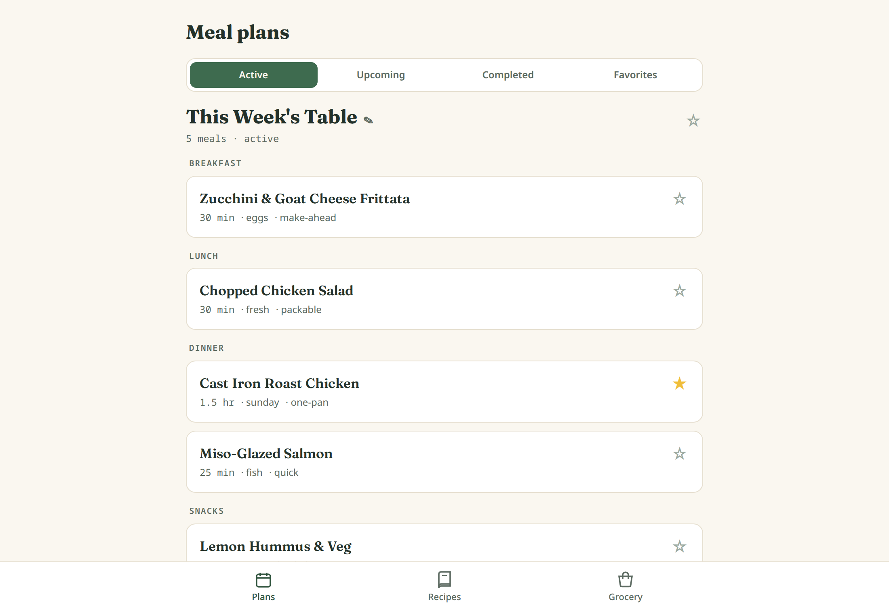
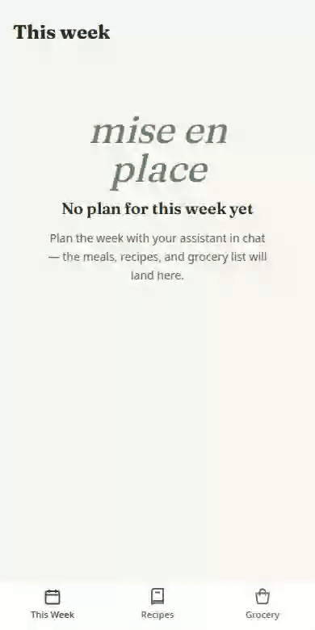

# mealforge

[](https://github.com/LooseWireDev/mealforge/actions/workflows/release.yml)
[](LICENSE)

**AI-planned meals, in a real app.** Plan conversationally with any MCP-capable AI chat (LibreChat, Claude, and friends) — the model pushes the finished plan here, where it becomes recipe cards, a step-by-step cook mode, and a grocery list you check off in the store. A plan is whatever you need it to be: a week of dinners, a few breakfasts, or one big Sunday cook — each meal tagged breakfast, lunch, dinner, or snack.

Meal-planning apps limit you to their recipe catalog. mealforge has **no catalog**: every recipe is generated in conversation, tailored to your household, constraints, and whatever sounds good right now. The app is the structured, shoppable, cookable home for what you and the model decide together.



| Grocery list, grouped by store section | Recipe with cook mode |
|:---:|:---:|
|  |  |

## How it works

```
┌────────────┐  MCP (streamable http)   ┌─────────────────────────────┐
│ your AI    │ ───────────────────────▶ │ mealforge                   │
│ chat       │  push_meal_plan          │  • active / upcoming /      │
│ (LibreChat,│  activate_meal_plan      │    completed meal plans     │
│  Claude,   │  search_recipes          │  • recipes + cook mode      │
│  etc.)     │  list_favorites …        │  • grocery list (derived)   │
└────────────┘                          │  • favorites + history      │
                                        └─────────────────────────────┘
```

1. **Plan in chat.** "Lots of crock pot this week, salmon once, use the pork shoulder in the freezer" — or "just three breakfasts for the long weekend." Iterate until it's right.
2. **The model pushes the final plan** (`push_meal_plan`): 1+ meals typed breakfast/lunch/dinner/snack, built from structured recipes — ingredients with quantities, units, and store sections — plus markdown cooking steps.
3. **One plan is active at a time.** New plans queue as *upcoming*; promote one when you're ready, and complete it when you've cooked through it. Completed plans become browsable history, and named plans can be favorited to cook again later.
4. **mealforge derives the grocery list** automatically from the active plan: ingredients aggregated across recipes ("2 cups" + "1 cup" → "3 cups"), grouped by store section, checkable while you shop.
5. **Favorite what you loved.** The model can recall favorite recipes *and* favorite plans ("run back taco week") and avoids repeating recent meals.

Here's the moment the plan lands, end to end — empty app, MCP push, recipe, cook mode, grocery run:

<p align="center"></p>

## Quick start (self-hosting)

All you need is Docker. Images are published to GHCR for **amd64 and arm64** (Raspberry Pi 4/5 and other ARM boards work).

```bash
mkdir mealforge && cd mealforge
curl -O https://raw.githubusercontent.com/loosewiredev/mealforge/main/docker-compose.yml
docker compose up -d
```

The web app and MCP endpoint are now on port `8090`:

- Web UI: `http://<host>:8090`
- MCP endpoint: `http://<host>:8090/mcp`

Data lives in a single SQLite file under `./data/` — back that folder up and you've backed up everything.

> **Security note:** mealforge has no built-in authentication. It is designed for a household on a private network — put it on your Tailscale/VPN, or behind a reverse proxy that does auth. Do not expose it to the public internet as-is.

### Configuration

One variable matters: set `APP_URL` (in the compose file or a `.env` next to it) to the URL your household uses, e.g. `APP_URL=https://mealforge.your-tailnet.ts.net` — the MCP tools return it so the model can link you to the app. See [`.env.example`](.env.example) for the full (short) list.

### Verify your install

```bash
bash <(curl -fsSL https://raw.githubusercontent.com/loosewiredev/mealforge/main/scripts/verify-mcp.sh) http://<host>:8090
```

This smoke-tests the MCP endpoint end-to-end: initialize, list tools, push a test plan, read it back, and mark it completed so it never becomes your active plan. The completed "Verify Script Test Plan" entry in your history is safe to ignore.

### Updating

```bash
docker compose pull && docker compose up -d
```

`latest` tracks main. Pin a specific version with the semver or `sha-*` tags on the [GHCR package](https://github.com/LooseWireDev/mealforge/pkgs/container/mealforge). To build from source instead of pulling, see the comments in [`docker-compose.yml`](docker-compose.yml).

## Connect your AI

Any client that speaks MCP over streamable HTTP works — point it at `http://<host>:8090/mcp`. No auth headers required (see the security note above).

### LibreChat

`librechat.yaml`:

```yaml
mcpServers:
  mealforge:
    type: streamable-http
    url: http://<host>:8090/mcp
    timeout: 60000
```

If mealforge runs on a private IP, also exempt it from LibreChat's SSRF guard:

```yaml
mcpSettings:
  allowedAddresses:
    - "<host>:8090"
```

Then restart the LibreChat container and enable the `mealforge` tools for your agent/endpoint.

### Claude Code

```bash
claude mcp add --transport http mealforge http://<host>:8090/mcp
```

### Claude Desktop

Settings → Connectors → **Add custom connector** → paste `http://<host>:8090/mcp`. (The URL must be reachable from the machine Claude Desktop runs on — on a tailnet, use the tailnet URL.)

## Teach your agent to meal-plan (recommended)

The repo ships a ready-made agent skill: [`skills/meal-planning/SKILL.md`](skills/meal-planning/SKILL.md). It teaches an agent the whole workflow: gather history first, draft the plan in conversation, publish only on explicit command via the reliable two-step flow (`create_recipe` per recipe, then one `push_meal_plan` with recipeIds), manage the active/upcoming/completed lifecycle on command, keep ingredient data grocery-list-clean, and recover from validation errors. Strongly recommended — especially with smaller models.

- **Claude Code / Agent Skills**: copy the `skills/meal-planning/` directory into your skills folder (e.g. `~/.claude/skills/`).
- **LibreChat**: paste the body of `SKILL.md` into your meal-planning agent's instructions (or attach it as an agent skill/file).
- **Anything else**: it's plain markdown — hand it to your agent however that client takes instructions.

## MCP tools

| Tool | Purpose |
|---|---|
| `create_recipe` | Save one recipe (flat payload) and get back a `recipeId` — the reliable first step before `push_meal_plan`. |
| `push_meal_plan` | Push a finalized plan of 1+ typed meals (new recipes and/or `recipeId` reuses). Becomes active if nothing is, else upcoming. Pass `planId` to revise a plan; checked-off grocery items that didn't change stay checked. |
| `list_meal_plans` | Plans with status, names, and meal titles — filter by status or favorites. For repeat-avoidance and recalling favorite plans. |
| `get_meal_plan` | One plan by `planId`. |
| `get_active_meal_plan` | The plan the household is cooking from right now, if any. |
| `activate_meal_plan` | Promote an upcoming (or completed) plan to active — fails while another plan is active. |
| `complete_meal_plan` | Mark a plan (default: the active one) as cooked through. |
| `list_favorites` | Recipes the household has favorited in the UI. |
| `search_recipes` | Search past recipes by title, tag, or ingredient. |
| `get_recipe` | Full recipe (ingredients + steps + meal types) by id. |

Tool inputs are deliberately forgiving (string numbers, fraction quantities like `"1/2"`, double-wrapped arrays all get coerced), and validation errors name the exact fields and include a valid example — so models can self-correct instead of failing.

## Development

Contributions welcome — see [CONTRIBUTING.md](CONTRIBUTING.md) for setup, checks, and conventions.

Requirements: Node 22 and pnpm (`corepack enable` gets you pnpm). It's an Nx monorepo: `apps/api` (Hono + tRPC + Drizzle + SQLite, serves the MCP endpoint and the built web app), `apps/web` (React + Vite + TanStack Router + Tailwind).

```bash
pnpm install
pnpm nx run-many -t test,build      # unit tests + builds
pnpm --filter @mealforge/api dev    # API on :3000
pnpm --filter @mealforge/web dev    # web on :5173 (proxies /trpc to :3000)

pnpm exec playwright test           # e2e against the production build (build first)
```

## License

[MIT](LICENSE)
